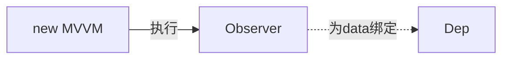
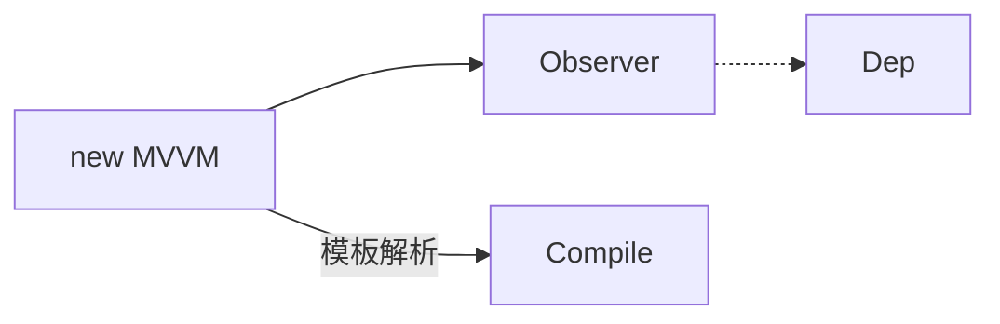
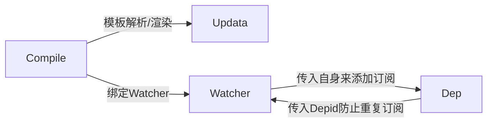
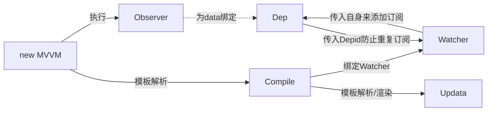

# Vue源码解析-模板解析与数据绑定



*首先是第一步*，创建Vue对象时，会把data里的所有属性做一个`数据劫持`。

`数据代理`也是在这里实现的，核心的技术是ECAMScript5的新特性：get()与set()方法。即用vm.xxx（未直接定义，本身定义在data里）代理_data对象里的xxx属性，并置`configurable`为false来防止该代理再次被定义。

而数据劫持则是对data里所有的数据进行重新定义，用到的核心技术同样是get()与set()方法，为每一个属性绑定上一个Dep对象。

Dep即是*dependency*，Dep拥有一个Depid来唯一标识自身，**其与data中所有的属性通过递归的方式实现一一对应**，每一个属性都会拥有自身的Dep对象，而Dep还有一个非常重要的属性则是：sub[]。

sub（subscriber）是一个数组，用于存放对应该属性的所有订阅者，即Watcher，但是在初始化阶段，这个数组还是空的。




*然后是第二步*，在完成Dep的初始化以后，vm主体执行`Compile`，通过先是通过文档树的每一个node进行递归遍历，取出文本节点，通过正则匹配，例如用

```js
const reg = /\{\{(.*)\}\}/
```

就能成功匹配到穿插在文档中的模板字符串（大括号表达式），然后再通过递归查找（因为有可能是多层属性）替换其中的值。

同理写在标签属性上的`v-text`、`v-on:click`等等，都可以通过取出attr属性名然后进行正则匹配，作出相应的处理，比如在绑定`v-on:click`时间，完成函数的监听设置后，还可以抹除掉该元素上的此属性，这样页面中就看不到标签上有任何指令属性了。

另外，如果在更新页面时，一个一个的查找，替换，渲染，更新页面会非常的慢，这里在更新页面时还用到了一个比较核心的技术：`document.createDocumentFragment`。其基本作用是创造一个储存在内存中的容器，然后用于存放我们在文档上收集的需要替换的节点（node），替换时，会将这些节点的父节点设置为此Fragment。此时由于一个节点只能拥有一个父节点，页面上的这些节点相当于被剪切出去了，此时页面的这些地方就会为空。然后在Fragment中，这些节点将会在内存中完成值的转换，这无论在初始化过程中还是在后续的更新节点中都是是将值替换成data中对应的值一个过程（`Updata`）。

> Updata过程只对应的是更新节点，不涉及查找节点。Updata更新时已经知道需要更新那些节点，并且根据其node的一些方法，获取其中模板字符串的值，然后用递归的方式来映射data中真实的值。

这样，规避了直接替换节点，浏览器引擎再渲染页面，如此重复多层的开销，页面的模板解析过程会快上许多。



在Compile的过程中，除了模板解析，还要做另外一件非常重要的事情，那就是初始化Watcher，为每一个属性值（大括号表达式里的值）绑定一个Watcher，即**Watcher与文档中的模板是一一对应的**。在模板解析时做的数据劫持需要用到get和set，但get和set并不是只做了这些。

> 在模板渲染时，最后需要取到data中的属性值，而此时便触发了代理的get方法。

Watcher在触发get方法时，传入自身。前面有将，在Observer阶段会将Dep与属性一一对应，此时get会将此时传入的Watcher添加入Dep的sub数组里，完成Watcher的订阅，而与此同时Dep也会回传自己的id标识，防止重复订阅。

```js
//当data中有多层属性时，比如
data: {
    a: {
        b: 'c'
    }
}
//因为添加订阅是一个递归的过程，在解析到模板 {{a.b}} 时，会将其用 . 给split开，进行递归订阅，设此时这个模板是w0，属性a是d0，b是d1。
//模板解析到这里会为w0添加a的订阅，Dep传回独一无二的a的Depid，然后递归如下一层，此时会为w0添加a和b两个属性的订阅，由于此时已经订阅了a，存储中已经有了d0，就知道自身已经订阅，便不会在订阅a。
```

总体来说，Dep和Watcher是一个 N对N  的关系。当一个data中的一个属性在文档中多次被引用时，它就拥有多个订阅者，而当一个模板字符串表征的是一个多层级的属性时，他就会订阅多个data属性值。

这个流程，就是页面完成初始化的过程。如下



**那么接下来，就是当data值改变的过程**

```mermaid
graph LR
G[数值改变] == data.a.b = 'd' ==>B[Observer]
B[Observer] == 被Set监测感知 ==> C[Dep]
C[Dep] == 通过sub通知 ==> F[Watcher]
F[Watcher] == 触发回调 ==> E[Updata]
```

> 在data改变，需要更新视图时，就触发了代理的set方法。

当我们去改变data中的值时，代理的set方法便起到了关键的作用。set要做的事情就是将新旧值进行对比，如果值确实发生了改变（设定任何值都会触发set函数），那么set会告知当前属性绑定的Dep，值已经发生了改变。Dep在接到通知后，会根据自身的sub数值，来一一通知订阅了自己的Watcher，值已经发生了改变，Watcher会通过回调的方式再次执行Updata，完成页面的更新。

虽然有点乱，但最后整个框架流程大概是这样的：

```mermaid
graph LR
A[new MVVM] -- 执行 --> B[Observer]
B[Observer] -. 为data绑定 .-> C[Dep]
A[new MVVM] -- 模板解析 -->D[Compile]
D[Compile] -- 模板解析/渲染 --> E[Updata]
D[Compile] -- 绑定Watcher --> F[Watcher]
C[Dep] -- 传入Depid防止重复订阅 --> F[Watcher]
F[Watcher] -- 传入自身来添加订阅 --> C[Dep]
G[数值改变] == data.a.b = 'd' ==>B[Observer]
B[Observer] == 被Set监测感知 ==> C[Dep]
C[Dep] == 通过sub通知 ==> F[Watcher]
F[Watcher] == 触发回调 ==> E[Updata]
```

​	*纵观整个框架的运行过程和函数设计，有非常多值得我们学习的过程，其多次用到了递归的思想，并且各个功能模块的划分非常独立，例如Updata更新数据时，只需要通知其数据已经变化，它就会自己去更新，不需要再去传入新值；又比如Dep去通知订阅者值发生改变时，其notify方法仅仅只是遍历了搜集的sub数组，然后通知，等等。`Object.defineProperty`可以说是整个Vue的核心方法，其Set和Get方法不仅仅实现了数据的代理 ，劫持，订阅的添加、消息的通知也依靠其来实现，整个框架真的是设计的非常巧妙。这篇文档虽然没有粘代码，但是想要真正理解，一定得自己去看看源码！*

> 2019年11月13日   by丁文星